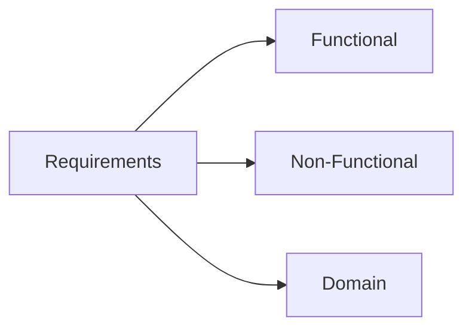

---
{"dg-publish":true,"permalink":"/1-mw-coe-420/w4-ch4/"}
---

[Chapter 4 Study Guide](ch4-requirements-engineering.html)

#### Functional & non-functional requirements
Functional requirements: input, output, storage, processing
NFR: constraints (time, speed, usability)

non-functional requirements affect functional requirements
- The NFR says: "The system must protect patient data."
- This **forces** you to add FRs like: "The system shall require two-factor authentication" and "The system shall encrypt all records."

Domain requirements: laws or from experts

# Ch4 — Requirements Engineering

---

## What is Requirements Engineering?

The process of establishing **what a customer needs** from a system and **the constraints** under which it operates.

The output? **System requirements** — descriptions of services and constraints.

---

## What is a Requirement?

Anything from a high-level abstract statement to a detailed mathematical spec.

> [!question] Why so broad? Requirements serve **two purposes**:
> 
> - **Basis for a bid** → must be open to interpretation
> - **Basis for a contract** → must be defined in detail

---

## Stakeholders

A **stakeholder** = anyone affected by the system who has a legitimate interest.

|Type|Who?|
|---|---|
|**End users**|Directly interact with the system|
|**System managers**|Manage daily operations|
|**System owners**|Commission and fund the system|
|**External**|Outside the org but still affected|

> [!example]- Mentcare System Stakeholders **Direct:** Patients, Doctors, Nurses, Receptionists, IT staff **Indirect:** Ethics manager, Healthcare managers, Medical records staff

---

## Three Types of Requirements

---

### 1. Functional Requirements

**What the system should do.** Statements about services, reactions to inputs, and expected behavior.

> [!example] Mentcare Examples
> 
> 1. Users **shall** be able to search appointment lists for all clinics.
> 2. The system **shall** generate a daily patient list per clinic.
> 3. Each staff member **shall** be identified by an 8-digit employee number.

> [!warning] Imprecision Problem The word **"search"** in Req 1:
> 
> - **User meant:** search across _all_ clinics at once
> - **Dev interpreted:** pick a clinic first, _then_ search
> 
> Ambiguous requirements → different implementations → project failure.

**Completeness** = all required facilities are described. **Consistency** = no conflicts between requirements. In practice, achieving both fully is **impossible** due to complexity.

---

### 2. Non-Functional Requirements (NFRs)

**How well the system performs.** Properties and constraints like reliability, speed, and storage.

> [!important] NFRs can be more critical than functional requirements. If unmet, the system may be **useless**.

#### NFR Classifications

|Type|Meaning|Example|
|---|---|---|
|**Product**|How the product must behave|Speed, reliability|
|**Organisational**|Org policies & procedures|Standards, dev tools|
|**External**|Outside factors|Laws, interoperability|

> [!example]- Mentcare NFR Examples
> 
> - **Product:** Available Mon–Fri 08:30–17:30. Max 5 sec downtime/day.
> - **Organisational:** Users authenticate via health authority ID card.
> - **External:** Must comply with patient privacy standard HStan-03-2006-priv.

#### NFR Impact on Architecture

- A single NFR (e.g. security) can **generate multiple functional requirements**.
- NFRs often affect **overall architecture**, not just individual components.
- E.g. performance NFRs → minimize inter-component communication.

---

### Goal vs. Testable Requirement

|                | Statement                                                                                      |
| -------------- | ---------------------------------------------------------------------------------------------- |
| ❌ **Goal**     | _"The system should be easy to use and minimize errors."_                                      |
| ✅ **Testable** | _"Staff shall use all functions after 4 hrs training. Max 2 errors/hr for experienced users."_ |

> [!tip] Always convert vague goals into **measurable, testable** requirements.

---

### NFR Metrics

| Property        | How to Measure                                                      |
| --------------- | ------------------------------------------------------------------- |
| **Speed**       | Transactions/sec, response time, refresh time                       |
| **Size**        | MBytes, ROM chips                                                   |
| **Ease of Use** | Training time, help frames                                          |
| **Reliability** | Mean time to failure, availability, failure3 rate                   |
| **Robustness**  | Restart time, % events causing failure, data corruption probability |
| **Portability** | % target-dependent code, number of target systems                   |

---

## Requirements Engineering Process

Four **generic activities** (iterative, not sequential):

> [!note] The RE Cycle
> 
> 1. **Elicitation** — gather requirements from stakeholders
> 2. **Analysis** — understand and refine them
> 3. **Validation** — check correctness and completeness
> 4. **Management** — handle changes over time

---

## Stories & Scenarios
**Why use them?** Stakeholders relate to real-life examples better than abstract specs.

### Scenario Structure

|Element|What it covers|
|---|---|
|**Starting situation**|Initial conditions|
|**Normal flow**|What happens when things go right|
|**What can go wrong**|Exceptions and edge cases|
|**Concurrent activities**|Other things happening simultaneously|
|**End state**|System state after completion|

> [!example]- iLearn Photo Upload Scenario 
> **Start:** User has photos on device, logged into KidsTakePics.
> 
> **Normal:** Select photos → choose project → add keywords → auto-named `user+filename` → system emails moderator → confirmation shown.
> 
> **Errors:**
> 
> - No moderator → email admin, warn user of delay
> - Duplicate name → re-upload (overwrite), rename (auto-number), or cancel
> 
> **Concurrent:** Moderator may approve photos in real-time.
> 
> **End state:** Photos uploaded with status "awaiting moderation."

---

## Writing Requirements

### Specification Methods

|Method|Best For|
|---|---|
|**Natural language**|General use — numbered sentences, one req each|
|**Structured natural language**|Standard templates with defined fields|
|**Graphical (UML)**|Use cases, sequence diagrams|
|**Tabular**|Alternative actions & conditions|
|**Mathematical**|Unambiguous specs (but hard for customers to verify)|

### Writing Guidelines

> [!tip] Five Rules
> 
> 1. Use a **standard format** consistently
> 2. **"Shall"** = mandatory · **"should"** = desirable
> 3. **Highlight** key parts
> 4. **Avoid jargon** — write for stakeholders
> 5. **Include rationale** — explain _why_ each requirement exists

> [!example] Insulin Pump — Requirement with Rationale 
> **Req 3.2:** Measure blood sugar and deliver insulin every 10 min. 
> _Why? Sugar changes slowly — more frequent is wasteful, less frequent is dangerous._

---

### Tabular Specification Example

> [!example] Insulin Pump — Dose Computation
> 
> |Condition|Action|
> |---|---|
> |Sugar falling `(r2 < r1)`|`CompDose = 0`|
> |Sugar stable `(r2 = r1)`|`CompDose = 0`|
> |Sugar rising, rate decreasing|`CompDose = 0`|
> |Sugar rising, rate stable/increasing|`CompDose = round((r2−r1)/4)` or MinimumDose|

---

## Use Cases (UML)

- Identify **actors** and describe the **interaction**
- A full set should cover **all possible interactions**
- High-level diagrams + detailed tabular descriptions
- **Sequence diagrams** add detail on event processing order

---

## Software Requirements Document (SRD)

The **official statement** of what developers must build.

> [!warning] SRD = WHAT, not HOW It is **not** a design document. It defines what the system should do, not how to implement it.

Contains both **user requirements** (what users need) and **system requirements** (detailed technical spec).

---

> [!abstract] Key Takeaways
> 
> - RE establishes **what** to build and **under what constraints**
> - **Functional** = what it does · **Non-functional** = how well · **Domain** = operational constraints
> - **Ambiguity** is the #1 cause of project problems
> - NFRs can make or break a system — always make them **testable**
> - Use **scenarios** to ground requirements in reality
> - The SRD describes **WHAT**, never **HOW**

---
 Requirements_Rationale_Fit Criterion.pptx 

---

###### Ice Breaker Project

**FR/Description:** "The system shall record the weather station reading."
**Rationale**: so readings are not lost
**Fit Criterion:** "The recorded weather station readings shall match the readings sent by the weather station."
> fit criterion means how do we verify its correct?

**NFR/Description:** "The system shall be **user friendly**."
**Rationale:** "So new users can learn the system fast."
**Fit Criterion:** "New users shall be able to add, change, and delete roads within 30 minutes of their first attempt at using the product."

