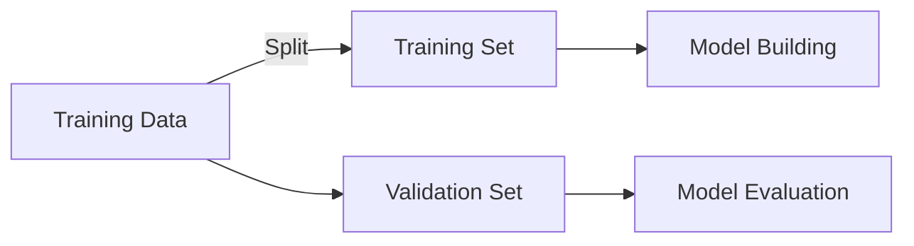
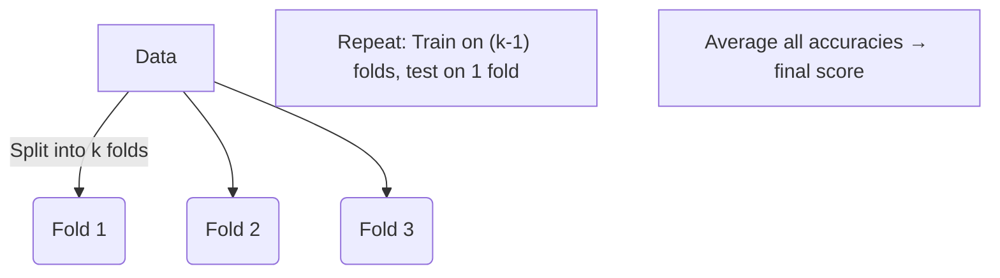

---
{"dg-publish":true,"permalink":"/2-machine-learning-notes/model-overfitting/"}
---


## 🧩 Overview
> [!quote] Definition  
> A model is said to be **overfitted** when it learns the *noise* instead of the *pattern* in the training data.

---

## ⚖️ Underfitting vs Overfitting

| Type                | Description                                                               | Training Error | Test Error |
| ------------------- | ------------------------------------------------------------------------- | -------------- | ---------- |
| 🔹 **Underfitting** | Model too simple; <span class="neon-highlight">fails to generalize</span> | ⬆️ High        | ⬆️ High    |
| 🔸 **Overfitting**  | Model too complex; <span class="neon-highlight">memorizes data</span>     | ⬇️ Low         | ⬆️ High    |

Fix overfitting: 
1. simplify (less parameters)
2. make a larger training data set (because then relatively it memorizes less)

| Term                  | Definition                                                        | What It Measures                                           |
| --------------------- | ----------------------------------------------------------------- | ---------------------------------------------------------- |
| 🧠 **Training Error** | The error your model makes **on the same data it was trained on** | How well the model **learned/memorized** the training data |
| 🔍 **Test Error**     | The error your model makes **on new, unseen data**                | How well the model **generalizes** to unseen examples      |

> ✅ **Goal:** Achieve **low training** and **low test** error → good generalization.

---

### 📈 Error Trend Visualization

```mermaid
graph LR
A[Model Complexity →] -->|Improves| B(Training Error ↓)
A --> C(Test Error)
style B fill:#88cc88,stroke:#333,stroke-width:1px
style C fill:#ffaaaa,stroke:#333,stroke-width:1px
````

> Notice how **training error decreases** as complexity increases, 
> but **test error** eventually rises again → **overfitting zone**.


---
## 🎯 Example — Decision Tree Growth

Dataset:
- (+) 5200 instances (5000 Gaussian + 200 noisy)
- (o) 5200 instances (Uniform)
- Split: 10% train, 90% test

```mermaid
graph TD
A["Decision Tree (4 nodes)"] -->|Simpler| B["Underfits"]
C["Decision Tree (50 nodes)"] -->|Too complex| D["Overfits"]
```

> The more nodes → the smaller training error  
> But after a point → higher testing error


>[!success]-
>Even though decision tree with 50 nodes looks like its performing better, it's actually not since its a less smooth boundary that seems to be more memorization (a case of overfitting) than simply capturing the main pattern (a sign of a more balanced decision tree).
>We see this here:
>
>As you can see, the model's test error increases as the number of nodes are added. (it was approx. 0.1 at 4)

---
**Generalization error** — how well it performs on unseen data.
## 🧮 Generalization Error Formula

> [!formula]  
> $$
> \text{Generalization Error(Model)} =  
> \text{Training Error(Model)} + \alpha \times \text{Complexity(Model)}  
> $$

Where:
- $\alpha$ = **trade-off constant** (penalty for complexity.)
	- Suppose two models have same training error
	- But one model is more complex than the other
	- This penalty would <u style="color:red">pick the simpler one</u>
- Simpler models are preferred if they achieve similar error → _Occam’s Razor._
---
## 🪞 Occam’s Razor

> [!tip] Principle  
> _“It is futile to do with more what can be done with fewer.”_  
> In ML: Prefer the **simplest model** that performs well.

---

## 🌲 Estimating Complexity in Decision Trees

> [!example] **Pessimistic Error Estimate**  
> $$ 
> err_{gen}(T) = err(T) + \alpha \times \frac{k}{N_{train}}  
> $$
> 
> - $err(T)$: error on training data
> - $k$: number of leaf nodes
> - $N_{train}$: total training samples
> - $\alpha$: cost per leaf node
> > [!note]
> > this is same as previous formula just complexity(model) changed (more leaf nodes = higher penalty)

**Example:**


> [!success]- Solution (if $\alpha=1$)
> 

---

## 🧠 Model Selection

### 🧩 Purpose

Ensure model is not overly complex → good **generalization**.

---

### 🔸 **Using Validation Set**



> **Drawback:** Less data left for training.

> [!question] Why validation set if there is testing set?
> It's to test the training set (initial testing) before the real test (so it can estimate errors and pick best model)

---

### 🔹 **Incorporating Model Complexity**

> [!note]  
> Add a complexity term to error:  
> $$GenError = TrainError + \alpha \times Complexity $$

✅ Prefer models with **lower generalization error**, even if training error is slightly higher.

---

## 🌳 Model Selection in Decision Trees

### ⚙️ **Pre-Pruning (Early Stopping)**

Stop tree growth **before** full expansion.

**Stopping Rules**

- All samples in a node belong to the same class
    
- All feature values identical
    
- Instances < `min_samples_split`
    
- No impurity improvement (e.g. Gini, Info Gain)
    
- Estimated generalization error below threshold
    

---

### ✂️ **Post-Pruning**

Grow the full tree, then **trim bottom-up**.

> [!example] _Subtree Replacement_  
> If replacing a subtree with a leaf **reduces generalization error**, prune it.

**Pessimistic Error Calculation Example:**

|State|Training Error|Penalty Term|Pessimistic Error|Decision|
|---|---|---|---|---|
|Before Split|10/30|0.5×(1/30)|**10.5/30**|—|
|After Split|9/30|0.5×(4/30)|**11/30**|🔪 _Prune (error ↑)_|

---

## 📏 Model Evaluation

> [!summary] **Goal:**  
> Estimate model performance on unseen data.

---

### 1️⃣ **Hold-Out Method**

- Split dataset → training (e.g. 80%) & testing (20%)
- Evaluate accuracy on test set
- Repeat with different random splits → average

---

### 2️⃣ **k-Fold Cross-Validation**



**Example (k=3):**

|Model|Train on|Test on|
|---|---|---|
|Model 1|Fold2 + Fold3|Fold1|
|Model 2|Fold1 + Fold3|Fold2|
|Model 3|Fold1 + Fold2|Fold3|

✅ Average test accuracy = model performance.

---

### 3️⃣ **Repeated CV**

Perform CV multiple times with random splits →  
gives **variance** of generalization error.

---

### 4️⃣ **Stratified CV**

Maintains the same **class distribution** in every fold.  
Useful for **imbalanced** datasets.

---

### 🧪 **Nested CV**

Used when doing **model tuning** _and_ **evaluation** simultaneously.  
Prevents **data leakage**.

---

## 🧰 In Scikit-Learn

```python
from sklearn.model_selection import cross_val_score, cross_validate

scores = cross_val_score(model, X, y, cv=5)
print("Average Accuracy:", scores.mean())
```
---

## 🧾 Summary

> [!check] Key Takeaways
> 
> -  **Overfitting** → low train error, high test error
>     
> -  **Underfitting** → both high
>     
> -  Control complexity → pre/post pruning
>     
> -  Use **cross-validation** to estimate true performance
>     
> -  Prefer **simpler models** when accuracy is similar
>     

---

## 🧭 Learning Outcomes

- ✅ Detect **overfitting/underfitting**
- ✅ Apply **validation set** and **complexity control**
- ✅ Perform **cross-validation** and interpret results
- ✅ Use **pruning** to improve decision tree generalization

---

> [!quote]  
> _"Training error tells you how well your model memorized.  
> Test error tells you how well your model learned."_